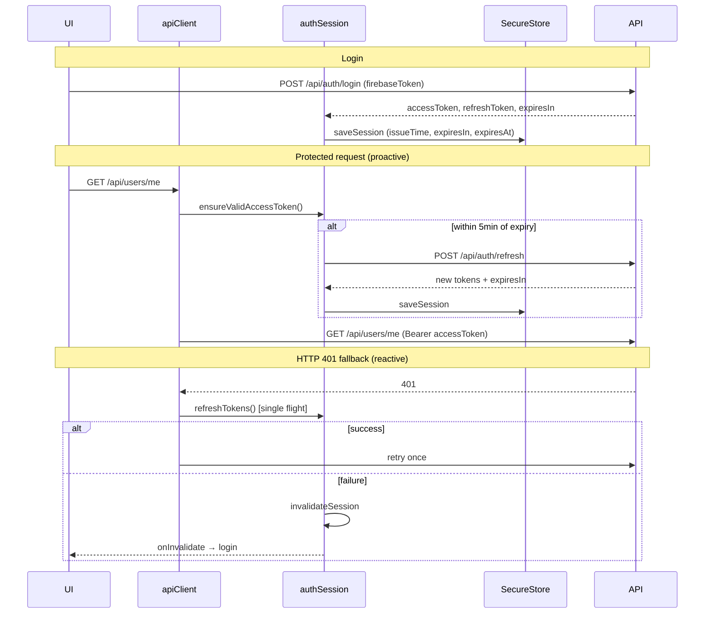

# Auth token lifecycle (proactive JWT refresh)

> Frontend behavior after proactive refresh integration. Backend contracts unchanged (`POST /api/auth/login`, `POST /api/auth/refresh`).

---

## Architecture

| Layer | Responsibility |
|-------|----------------|
| **`tokenStorage`** | SecureStore: `accessToken`, `refreshToken`, `expiresIn`, `tokenIssueTime`, `expiresAt` |
| **`authSession`** | Single source of truth: hydrate, proactive refresh, reactive refresh, invalidate, refresh single-flight |
| **`apiClient`** | Before each protected request: `ensureValidAccessToken()`; on HTTP 401: one reactive refresh + retry |
| **`authStore`** | Bootstrap / restore via `ensureValidAccessToken()`; listens for `onInvalidate` → clear user → `_layout` → login |

Screens never call refresh directly.

---

## Token lifecycle flow

---

## Expiry calculation

- On save: `tokenIssueTime = Date.now()`, `expiresAt = issueTime + expiresIn * 1000`
- Default `expiresIn` if omitted: **3600** s (contract default)
- **Proactive refresh** when: `now >= expiresAt - 5 minutes` (`ACCESS_TOKEN_REFRESH_BUFFER_MS`)

---

## Edge cases handled

| Case | Behavior |
|------|----------|
| Concurrent API calls near expiry | All await same `refreshPromise` (single flight) |
| Refresh fails | `invalidateSession` → clear SecureStore → `onInvalidate` → store clears user → login redirect |
| HTTP 401 after proactive refresh | One reactive refresh + **one** retry (`isRetry` flag) |
| Second 401 on retry | Throws `SESSION_EXPIRED` — no infinite loop |
| App restart | `loadSession` restores issue time + expiresIn; recomputes `expiresAt`; bootstrap calls `ensureValidAccessToken` |
| Legacy sessions (expiresAt only) | Still load; recompute from issueTime+expiresIn when both present |
| Logout in progress | `handleSessionInvalidated` skipped if `isLoggingOut` |
| Missing refresh token | Immediate invalidate, no refresh HTTP call |
| Dev logging | `[authSession]` traces only when `__DEV__` (no token values) |

---

## Testing checklist

### Proactive refresh
- [ ] Log in; wait until &lt; 5 min before expiry (or shorten buffer in dev) — next API call refreshes without 401
- [ ] Trigger two parallel requests near expiry — only one `POST /api/auth/refresh` (network tab / dev logs)

### App restart
- [ ] Log in; kill app; reopen before expiry — session restored, profile loads
- [ ] Log in; kill app; reopen after access token would expire — proactive refresh on bootstrap, profile loads
- [ ] Log in; kill app; reopen after refresh token revoked — lands on login, no crash loop

### Reactive fallback
- [ ] Force 401 (revoke access server-side) with valid refresh — request succeeds after retry
- [ ] Invalidate refresh token — single failure → login screen, no repeated refresh spam

### Failure / navigation
- [ ] Refresh failure clears user and redirects to login (`_layout` auth guard)
- [ ] Logout still calls `POST /api/auth/logout` then clears storage

### Regression
- [ ] Google / OTP login still persists `expiresIn` from login response
- [ ] Protected lists (dashboard, explore) load without manual re-login during normal session

---

*Buffer: 5 minutes · Storage: `expo-secure-store` · Contract: `API_CONTRACTS.md` §5*
